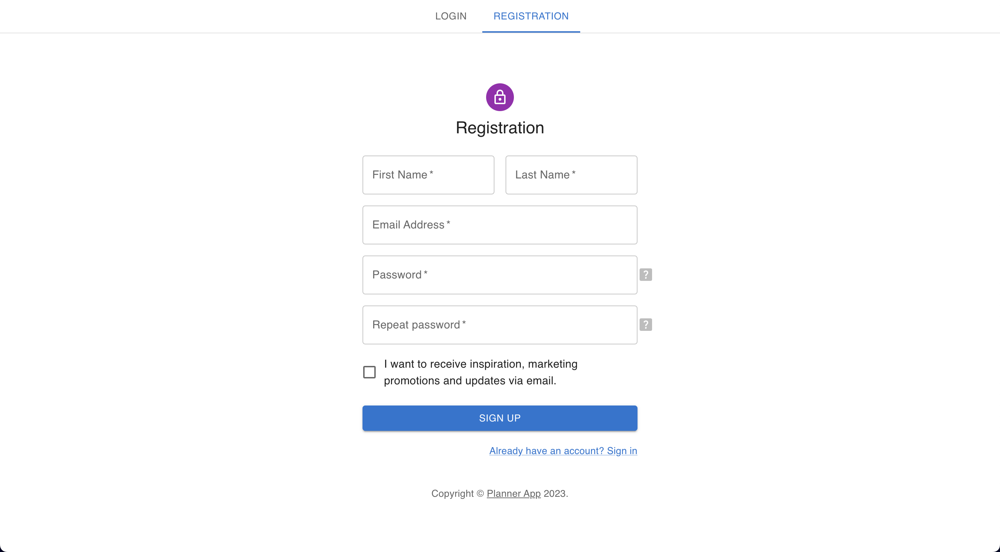
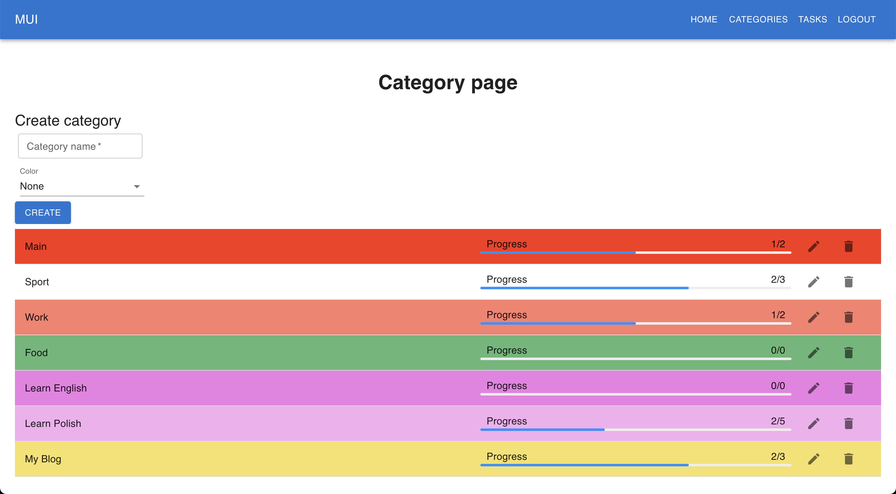
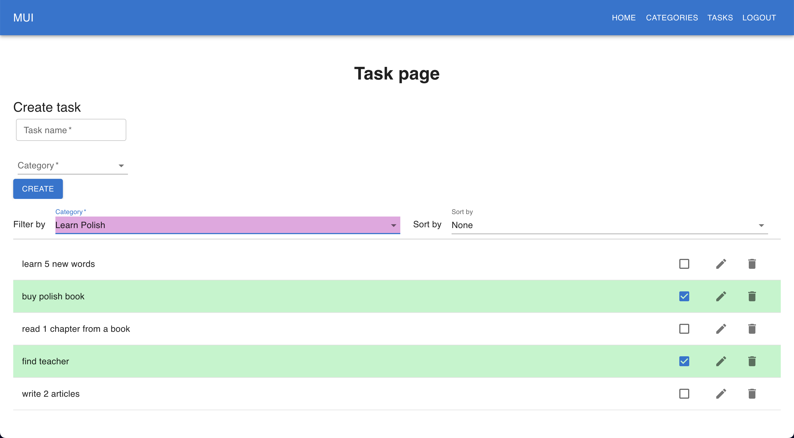

# Planner app (DEMO)
Hi, nice to see you here! Navigation:

[What technologies/tools were used in the project?](#tools)

[What is already implemented in the application?](#implemented)

[How to install and run App?](#installation)

[What does the application look like? (screenshots)](#screenshots)

## About project

The main idea is that the App will help users achieve their goals and make their life better. Users will be able to set goals for the year, create tasks for each day and categories for them, customize the workspace as they want and see how much time they spent on the tasks and goals.

***Note: It's first version of app (DEMO). A list of [what has already been implemented](#implemented) in the project.***

## Technologies/tools
***The project is being developed in a private repository. This repository was only created to showcase my skills to employers and will then be removed.***

This APP developed with React/Redux/Typescript.

- using json-server and json-server-auth to work with backend;
- using JWT access tokens for user authentication;
- working with REST api;
- using react-router;
- using Material UI / SCSS / CSS modules;
- using media-queries for creating responsive pages;
- using vite instead of webpack;
- added and configured eslint;

## What is currently implemented
***All pages in the project are responsive (mobile, tablet, desktop).***

- created custom Homepage using SCSS (with cool custom slider);
- created login and register pages (using Material UI). Implemented user registration and authorization, implemented form validation and handling of various errors;
- created template for dashboards pages (using Material UI);
- configured private routes with access only for logged in users (using react-router);
- added guarded routes so that users can only change their tasks and categories (using JWT access tokens);
- created category page. Adding, deleting, editing categories, as well as displaying the status of tasks in a category (using Material UI);
- created task page. Adding, deleting, editing tasks. Sorting tasks by categories and filtering by different parameters is also implemented. (using Material UI);
- added lazy loading of pages;
- created different components and UI Kit components;

***Updates coming soon... Thank you for your attention!***

## Installation
1. Install json server: `npm i -g json-server`
2. Install all npm packages: `npm i`
3. Run the app: `npm start`
   ***Json Server runs on 5002 port, if you need to use a different port, change it in the `package.json` file in the `start` script.***

## screenshots

